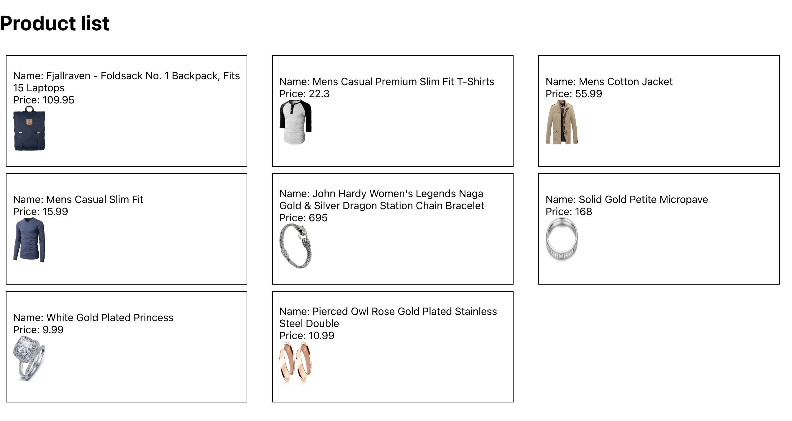

# React assignment

## How to run the project

1. Step 1: yarn
2. Step 2: yarn start

## Requirement

In `App.js` we have a product array, using map method and passing props, please display the product data in the `ProductItem.js` components

## Screenshot

Deploy link: https://hyacinth-bruno.github.io/ISA6-ReactProps/
